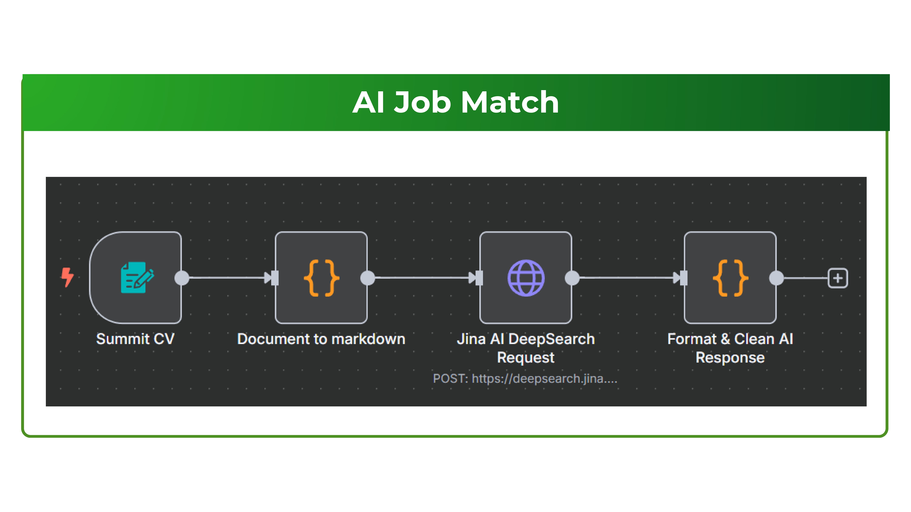

# 🚀 JobFit.AI - AI-Powered Job Matching Platform

<p align="center">
  
</p>

<p align="center">
  <strong>The smart way to find your perfect job match using artificial intelligence</strong>
</p>

<p align="center">
  <a href="#features">Features</a> •
  <a href="#quick-start">Quick Start</a> •
  <a href="#architecture">Architecture</a> •
  <a href="#installation">Installation</a> •
  <a href="#api-documentation">API Docs</a> •
  <a href="#contributing">Contributing</a>
</p>

---

## 📖 Overview

JobFit.AI is a comprehensive job matching platform that uses artificial intelligence to connect job seekers with their ideal opportunities. Our platform provides intelligent resume analysis, personalized job recommendations, career roadmap planning, and AI-powered interview preparation to help users advance their careers.

### 🎯 What Makes JobFit.AI Special

- **Smart Job Matching**: Advanced AI algorithms analyze your skills, experience, and preferences to find the perfect job matches
- **Resume Intelligence**: Get detailed feedback and suggestions to improve your resume with AI analysis
- **Career Roadmap Planning**: Receive personalized career development plans with step-by-step guidance
- **Interview Preparation**: Practice with AI-powered mock interviews tailored to specific job roles
- **Employer Tools**: Advanced candidate screening and evaluation tools for recruiters

## ✨ Features

### 🔍 For Job Seekers

<table>
<tr>
<td width="50%">

**🎯 AI Job Matching**
- Upload your resume and get instant job recommendations
- Smart filtering based on skills, experience, and preferences
- Real-time match scoring with detailed explanations
- Save favorites and track application status

**📄 Resume Assistant**
- AI-powered resume analysis and scoring
- Section-by-section improvement suggestions
- Professional resume building tools
- Multiple resume templates and formats

</td>
<td width="50%">

**🗺️ Career Roadmap**
- Personalized career progression paths
- Skills gap analysis and recommendations
- Learning resource suggestions
- Timeline planning for career goals

**💼 Interview Preparation**
- Job-specific interview question generation
- AI feedback on your responses
- Practice sessions with real-time coaching
- Industry-specific interview scenarios

</td>
</tr>
</table>

### 🏢 For Employers

- **Advanced Candidate Search**: Find candidates with precise skill matching
- **Resume Screening**: AI-powered candidate evaluation and ranking
- **Job Posting Management**: Easy job creation with skill requirement matching
- **Analytics Dashboard**: Insights into hiring performance and candidate quality

## 🏗️ Architecture

### Technology Stack

<table>
<tr>
<td><strong>Full-Stack Framework</strong></td>
<td><strong>Frontend Technologies</strong></td>
<td><strong>Backend APIs</strong></td>
<td><strong>AI & External Services</strong></td>
</tr>
<tr>
<td>
• Next.js 14 (Full-Stack)<br>
• TypeScript<br>
• App Router<br>
• API Routes (Backend)<br>
• Server Components<br>
• Edge Functions
</td>
<td>
• React 18<br>
• Tailwind CSS<br>
• Framer Motion<br>
• Radix UI Components<br>
• Zustand (State Management)<br>
• Responsive Design
</td>
<td>
• Next.js API Routes<br>
• RESTful Endpoints<br>
• Server Actions<br>
• Middleware<br>
• Edge Runtime<br>
• Request/Response Handling
</td>
<td>
• OpenAI GPT Models<br>
• Google Gemini<br>
• Jina AI (Embeddings)<br>
• DeepSeek API<br>
• LemonFox API<br>
• Document Processing
</td>
</tr>
</table>

### Database & Storage

<table>
<tr>
<td><strong>Authentication & Storage</strong></td>
<td><strong>Caching & Session</strong></td>
<td><strong>File Storage</strong></td>
</tr>
<tr>
<td>
• Supabase (Auth & Database)<br>
• PostgreSQL (Primary DB)<br>
• Row-level Security<br>
• Real-time Subscriptions
</td>
<td>
• Redis (Session Management)<br>
• In-memory Caching<br>
• Rate Limiting<br>
• Interview State Management
</td>
<td>
• Supabase Storage<br>
• File Upload Handling<br>
• Resume/CV Storage<br>
• Image Assets
</td>
</tr>
</table>

### Project Structure

```
JobFit.AI/
├── Project/                     # Full-Stack Next.js Application
│   ├── app/                    # App Router (Next.js 14)
│   │   ├── (routes)/           # Page Routes
│   │   │   ├── dashboard/      # User Dashboard
│   │   │   ├── cv-assistant/   # Resume Analysis Tools
│   │   │   ├── job-match/      # Job Matching Interface
│   │   │   ├── interviewer/    # Interview Preparation
│   │   │   ├── roadmap/        # Career Planning
│   │   │   └── employer/       # Employer Portal
│   │   └── api/                # Backend API Routes
│   │       ├── cv-analysis/    # Resume Processing API
│   │       ├── job-match/      # Job Matching API
│   │       ├── interview/      # Interview Management API
│   │       ├── generate-roadmap/ # Career Roadmap API
│   │       └── employer/       # Employer Services API
│   ├── components/             # React Components
│   │   ├── ai-job-match/       # Job Matching UI
│   │   ├── ai-cv-assistant/    # Resume Tools UI
│   │   ├── ai-interviewer/     # Interview Components
│   │   ├── ai-roadmap/         # Career Planning UI
│   │   ├── employer/           # Employer Components
│   │   └── ui/                 # Base UI Components
│   ├── lib/                    # Utilities & API Clients
│   ├── store/                  # State Management (Zustand)
│   ├── context/                # React Context Providers
│   └── config/                 # Configuration Files
│
├── Overview_Img/               # Platform Screenshots
├── info.md                     # Project Documentation
└── README.md                   # Main Documentation
```

### API Routes (Backend Functionality)

The Next.js API routes provide all backend functionality:

**Core APIs:**
- `/api/job-match` - AI-powered job matching and analysis
- `/api/cv-analysis` - Resume parsing and scoring
- `/api/interview/` - Interview question generation and management
- `/api/generate-roadmap` - Career roadmap creation
- `/api/employer/` - Employer dashboard and job management

**Interview System:**
- `/api/interview/start` - Initialize interview sessions
- `/api/interview/session/[id]` - Manage interview state
- `/api/interview/voice` - Voice recording and speech-to-text
- `/api/interview/answer` - Process interview responses

## 🚀 Quick Start

### Prerequisites

- **Node.js** 18+ and npm/yarn
- **Git** for version control
- **Supabase Account** (for authentication and database)
- **Redis** (optional, for caching and session management)

### 1. Clone the Repository

```bash
git clone https://github.com/zok213/JobFit.git
cd JobFit
```

### 2. Application Setup

```bash
# Navigate to the application directory
cd Project

# Install dependencies
npm install
# or
yarn install

# Set up environment variables
cp .env.example .env.local
# Edit .env.local with your configuration (see Configuration section below)

# Run the development server
npm run dev
# or
yarn dev
```

The application will be available at `http://localhost:3000`

### 3. Configuration

Create a `.env.local` file in the `Project` directory with:

```bash
# Supabase Configuration (Required)
NEXT_PUBLIC_SUPABASE_URL=your-supabase-project-url
NEXT_PUBLIC_SUPABASE_ANON_KEY=your-supabase-anon-key

# AI Service Keys (Required for full functionality)
JINA_API_KEY=your-jina-api-key
DEEPSEEK_API_KEY=your-deepseek-api-key
LEMONFOX_API_KEY=your-lemonfox-api-key

# Optional: External Services
NEXT_PUBLIC_API_URL=http://localhost:3000
GOOGLE_API_KEY=your-google-api-key
```

### 4. Access the Platform

Open your browser and navigate to:

- **Main Application**: http://localhost:3000
- **Dashboard**: http://localhost:3000/dashboard
- **Job Matching**: http://localhost:3000/job-match
- **CV Assistant**: http://localhost:3000/cv-assistant
- **Interview Prep**: http://localhost:3000/interviewer
- **Career Roadmap**: http://localhost:3000/roadmap

## 🔧 Installation & Configuration

### Environment Variables

Create a `.env.local` file in the `Project` directory:

```bash
# Supabase Configuration (Required)
NEXT_PUBLIC_SUPABASE_URL=your-supabase-project-url
NEXT_PUBLIC_SUPABASE_ANON_KEY=your-supabase-anon-key

# AI Service Keys (Required for full functionality)
JINA_API_KEY=your-jina-api-key
DEEPSEEK_API_KEY=your-deepseek-api-key
LEMONFOX_API_KEY=your-lemonfox-api-key

# Optional Configuration
NEXT_PUBLIC_API_URL=http://localhost:3000
GOOGLE_API_KEY=your-google-api-key
```

### Database Setup (Supabase)

1. **Create a Supabase Project**
   - Go to [supabase.com](https://supabase.com)
   - Create a new project
   - Copy your project URL and anon key

2. **Database Tables** (Auto-created by the application)
   - User profiles and authentication
   - Resume/CV storage
   - Interview sessions and results
   - Job matching data

### AI Service Setup

1. **Jina AI** (For embeddings and search)
   - Sign up at [jina.ai](https://jina.ai)
   - Get your API key from the dashboard

2. **DeepSeek API** (For interview AI)
   - Register for DeepSeek API access
   - Add your API key to the environment

3. **LemonFox API** (For additional AI features)
   - Contact provider for API access
   - Configure your API key

## 📚 API Documentation

### Core Endpoints

#### Authentication
- `POST /api/auth/register` - User registration
- `POST /api/auth/token` - Login and get JWT token
- `GET /api/auth/me` - Get current user information

#### Job Management
- `GET /api/jobs/` - List available jobs with filtering
- `POST /api/jobs/` - Create new job posting (employers)
- `GET /api/jobs/{job_id}` - Get job details
- `POST /api/jobs/{job_id}/match` - Get job match score

#### Resume Management
- `GET /api/resumes/` - Get user resumes
- `POST /api/resumes/` - Upload and parse new resume
- `PUT /api/resumes/{resume_id}` - Update resume information
- `DELETE /api/resumes/{resume_id}` - Delete resume

#### AI Services
- `POST /api/ai/generate` - Generate text with AI models
- `POST /api/roadmaps/generate` - Create career roadmap
- `POST /api/interviews/questions` - Generate interview questions

### Rate Limiting

API requests are rate-limited based on user tiers:
- **Free Users**: 100 requests per minute
- **Premium Users**: 1000 requests per minute
- **Enterprise**: Custom limits

### Authentication

The API uses JWT tokens for authentication:

```bash
# Login to get token
curl -X POST "http://localhost:8000/api/auth/token" \
     -H "Content-Type: application/x-www-form-urlencoded" \
     -d "username=user@example.com&password=yourpassword"

# Use token in subsequent requests
curl -X GET "http://localhost:8000/api/jobs/" \
     -H "Authorization: Bearer YOUR_JWT_TOKEN"
```

## 🖼️ Platform Screenshots

<table>
<tr>
<td width="50%">

<p align="center"><em>AI-Powered Job Matching</em></p>
</td>
<td width="50%">

<p align="center"><em>Resume Analysis & Feedback</em></p>
</td>
</tr>
<tr>
<td width="50%">

<p align="center"><em>Personalized Career Roadmaps</em></p>
</td>
<td width="50%">

<p align="center"><em>AI Interview Preparation</em></p>
</td>
</tr>
</table>

## 🚀 Deployment

### Production Infrastructure

#### Startup Tier (Cost-Optimized)
- **Frontend**: Vercel (Hobby Plan)
- **Backend**: Render Web Services
- **Database**: Supabase (Free Tier)
- **Caching**: Upstash Redis
- **Storage**: Supabase Storage

#### Growth Tier (Scalable)
- **Frontend**: Vercel (Enterprise)
- **Backend**: AWS ECS or Azure Container Apps
- **Database**: AWS RDS PostgreSQL
- **Caching**: Redis Cluster
- **CDN**: CloudFront or Azure CDN

### Docker Deployment

```bash
# Build and run with Docker Compose
docker-compose up -d

# Or build individual services
docker build -t jobfit-project ./Project
```

## 🧪 Testing

### Backend Testing
```bash
cd Backend
pytest tests/ -v
pytest tests/test_api.py::test_job_matching -v
```

### Project Testing
```bash
cd Project
npm test
npm run test:coverage
```

### API Testing
```bash
# Test API endpoints
curl -X GET "http://localhost:8000/api/test/echo"
curl -X GET "http://localhost:8000/api/test/db-check"
```

## 🤝 Contributing

We welcome contributions to JobFit.AI! Here's how you can help:

### Getting Started
1. Fork the repository
2. Create a feature branch: `git checkout -b feature/amazing-feature`
3. Make your changes and test them
4. Commit your changes: `git commit -m 'Add amazing feature'`
5. Push to the branch: `git push origin feature/amazing-feature`
6. Open a Pull Request

### Development Guidelines
- Follow the existing code style
- Write tests for new features
- Update documentation as needed
- Ensure all tests pass before submitting

### Areas for Contribution
- 🐛 Bug fixes and improvements
- ✨ New AI models and algorithms
- 🎨 UI/UX enhancements
- 📚 Documentation improvements
- 🧪 Test coverage expansion

## 📈 Roadmap

### Current Version (v1.0)
- ✅ Core job matching functionality
- ✅ Resume analysis and feedback
- ✅ Basic career roadmap generation
- ✅ Interview question generation

### Upcoming Features (v1.1)
- 🔄 Real-time job notifications
- 📊 Advanced analytics dashboard
- 🎯 Company culture matching
- 📱 Mobile application

### Future Plans (v2.0)
- 🤖 Advanced AI conversations
- 🌐 Multi-language support
- 🔗 LinkedIn integration
- 📈 Salary prediction models

## 📞 Support & Contact

### Documentation
- **API Docs**: http://localhost:8000/docs
- **User Guide**: [Coming Soon]
- **Developer Docs**: [Coming Soon]

### Community
- **Issues**: [GitHub Issues](https://github.com/your-username/JobFit/issues)
- **Discussions**: [GitHub Discussions](https://github.com/your-username/JobFit/discussions)
- **Discord**: [Coming Soon]

### Commercial Support
For enterprise support and custom implementations:
- 📧 Email: support@jobfit.ai
- 💼 Enterprise: enterprise@jobfit.ai

## 📄 License

This project is licensed under the MIT License - see the [LICENSE](LICENSE) file for details.

## 🙏 Acknowledgments

- OpenAI for powerful language models
- Supabase for authentication and storage
- Vercel for hosting and deployment
- The open-source community for amazing tools and libraries

---

<p align="center">
  <strong>Made with ❤️ by the JobFit.AI Team</strong>
</p>

<p align="center">
  <a href="#top">Back to Top</a>
</p>
